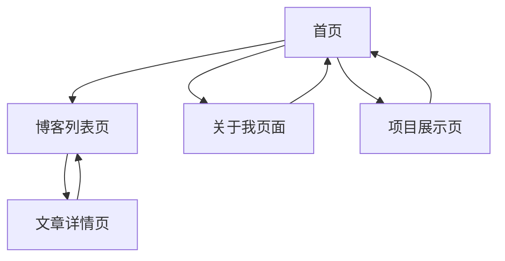

# 个人博客网页 - 产品需求文档

## 1. Product Overview
一个基于Vue3框架的现代化个人博客网站，专为GitHub Pages部署优化，提供简洁美观的文章展示和个人信息展示功能。
该博客旨在为开发者、写作者或任何希望在网络上分享想法的个人提供一个专业的展示平台，支持Markdown文章编写和响应式设计。

## 2. Core Features

### 2.1 User Roles
本项目为静态个人博客，不需要用户注册登录功能，所有访问者均为匿名访问者。

### 2.2 Feature Module
我们的个人博客包含以下主要页面：
1. **首页**: 个人介绍区域、最新文章展示、导航菜单
2. **博客列表页**: 文章列表展示、分类筛选、搜索功能
3. **文章详情页**: 文章内容展示、目录导航、分享功能
4. **关于我页面**: 个人详细介绍、技能展示、联系方式
5. **项目展示页**: 个人项目作品集、项目详情链接

### 2.3 Page Details

| Page Name | Module Name | Feature description |
|-----------|-------------|---------------------|
| 首页 | Hero区域 | 展示个人头像、姓名、职业描述和简短介绍 |
| 首页 | 最新文章 | 显示最近发布的3-5篇文章预览，包含标题、摘要、发布时间 |
| 首页 | 导航菜单 | 提供到各个页面的快速导航链接 |
| 博客列表页 | 文章列表 | 分页展示所有博客文章，包含标题、摘要、标签、发布时间 |
| 博客列表页 | 分类筛选 | 按标签或分类筛选文章 |
| 博客列表页 | 搜索功能 | 支持按标题和内容搜索文章 |
| 文章详情页 | 文章内容 | 完整展示Markdown格式的文章内容，支持代码高亮 |
| 文章详情页 | 目录导航 | 自动生成文章目录，支持锚点跳转 |
| 文章详情页 | 文章信息 | 显示发布时间、阅读时长、标签等元信息 |
| 关于我页面 | 个人介绍 | 详细的个人背景、经历、兴趣爱好介绍 |
| 关于我页面 | 技能展示 | 技术栈、专业技能的可视化展示 |
| 关于我页面 | 联系方式 | 邮箱、社交媒体链接等联系信息 |
| 项目展示页 | 项目列表 | 展示个人项目作品，包含项目截图、描述、技术栈 |
| 项目展示页 | 项目详情 | 提供项目演示链接、源码链接等 |

## 3. Core Process
**访问者浏览流程**：
访问者进入首页 → 浏览个人介绍和最新文章 → 点击文章进入详情页阅读 → 通过导航访问博客列表页查看更多文章 → 访问关于我页面了解个人信息 → 查看项目展示页了解作品

## 4. User Interface Design
### 4.1 Design Style
- **主色调**: 深蓝色 (#2563eb) 和浅灰色 (#f8fafc)
- **辅助色**: 绿色 (#10b981) 用于强调，橙色 (#f59e0b) 用于警告
- **按钮样式**: 圆角按钮，支持悬停效果和渐变背景
- **字体**: 中文使用"PingFang SC"，英文使用"Inter"，代码使用"Fira Code"
- **布局风格**: 卡片式设计，顶部导航栏，响应式网格布局
- **图标风格**: 使用简洁的线性图标，支持SVG格式

### 4.2 Page Design Overview

| Page Name | Module Name | UI Elements |
|-----------|-------------|-------------|
| 首页 | Hero区域 | 居中布局，大头像，渐变背景，动画效果 |
| 首页 | 最新文章 | 卡片式布局，阴影效果，悬停动画 |
| 博客列表页 | 文章列表 | 列表式卡片，左侧缩略图，右侧文字信息 |
| 博客列表页 | 搜索筛选 | 顶部搜索框，标签云展示 |
| 文章详情页 | 文章内容 | 最大宽度限制，行间距优化，代码块高亮 |
| 文章详情页 | 目录导航 | 固定侧边栏，当前位置高亮 |
| 关于我页面 | 技能展示 | 进度条或标签云形式展示技能水平 |
| 项目展示页 | 项目卡片 | 网格布局，项目截图，悬停显示详情 |

### 4.3 Responsiveness
采用移动端优先的响应式设计：
- 桌面端 (>1024px): 多列布局，侧边栏导航
- 平板端 (768px-1024px): 两列布局，收缩侧边栏
- 移动端 (<768px): 单列布局，汉堡菜单导航
- 支持触摸手势，优化移动端阅读体验