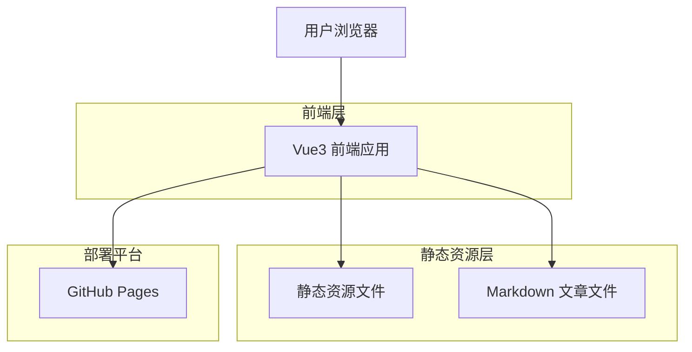

# 个人博客网页 - 技术架构文档

## 1. Architecture design



## 2. Technology Description
- Frontend: Vue@3 + Vue Router@4 + Vite@5 + TailwindCSS@3
- Markdown处理: markdown-it + highlight.js
- 部署: GitHub Pages (静态站点)

## 3. Route definitions

| Route | Purpose |
|-------|---------|
| / | 首页，展示个人介绍和最新文章 |
| /blog | 博客列表页，显示所有文章列表 |
| /blog/:slug | 文章详情页，显示具体文章内容 |
| /about | 关于我页面，展示个人详细信息 |
| /projects | 项目展示页，展示个人作品集 |
| /404 | 404错误页面 |

## 4. API definitions
由于是静态博客，不涉及后端API，所有数据通过静态JSON文件和Markdown文件提供。

### 4.1 数据结构定义

文章元数据结构：
```typescript
interface Article {
  id: string;
  title: string;
  slug: string;
  excerpt: string;
  content: string;
  publishDate: string;
  updateDate?: string;
  tags: string[];
  category: string;
  readingTime: number;
  featured: boolean;
}
```

项目信息结构：
```typescript
interface Project {
  id: string;
  title: string;
  description: string;
  image: string;
  technologies: string[];
  demoUrl?: string;
  githubUrl?: string;
  featured: boolean;
}
```

个人信息结构：
```typescript
interface Profile {
  name: string;
  title: string;
  bio: string;
  avatar: string;
  email: string;
  social: {
    github?: string;
    linkedin?: string;
    twitter?: string;
  };
  skills: {
    name: string;
    level: number;
  }[];
}
```

## 5. 数据存储结构

### 5.1 文件组织结构
```
public/
├── data/
│   ├── profile.json          # 个人信息
│   ├── articles.json         # 文章元数据
│   └── projects.json         # 项目信息
├── articles/
│   ├── article-1.md          # Markdown文章文件
│   ├── article-2.md
│   └── ...
└── images/
    ├── avatar.jpg            # 头像
    ├── projects/             # 项目截图
    └── articles/             # 文章配图
```

### 5.2 配置文件示例

文章元数据 (articles.json):
```json
[
  {
    "id": "1",
    "title": "Vue3 组合式API实践指南",
    "slug": "vue3-composition-api-guide",
    "excerpt": "深入探讨Vue3组合式API的使用方法和最佳实践",
    "publishDate": "2024-01-15",
    "tags": ["Vue3", "JavaScript", "前端"],
    "category": "技术分享",
    "readingTime": 8,
    "featured": true
  }
]
```

个人信息 (profile.json):
```json
{
  "name": "张三",
  "title": "前端开发工程师",
  "bio": "热爱技术，专注于现代前端开发",
  "avatar": "/images/avatar.jpg",
  "email": "example@email.com",
  "social": {
    "github": "https://github.com/username",
    "linkedin": "https://linkedin.com/in/username"
  },
  "skills": [
    {"name": "Vue.js", "level": 90},
    {"name": "React", "level": 85},
    {"name": "TypeScript", "level": 80}
  ]
}
```

## 6. 构建和部署流程

### 6.1 开发环境设置
```bash
# 安装依赖
npm install

# 开发服务器
npm run dev

# 构建生产版本
npm run build

# 预览构建结果
npm run preview
```

### 6.2 GitHub Pages 部署配置
- 使用 GitHub Actions 自动化部署
- 构建输出目录: `dist/`
- 部署分支: `gh-pages` 或直接使用 `main` 分支的 `docs/` 目录
- 自定义域名支持 (可选)

### 6.3 SEO 优化配置
- 使用 Vue Meta 或 @vueuse/head 管理页面元数据
- 生成 sitemap.xml
- 配置 robots.txt
- 支持 Open Graph 和 Twitter Card 元标签